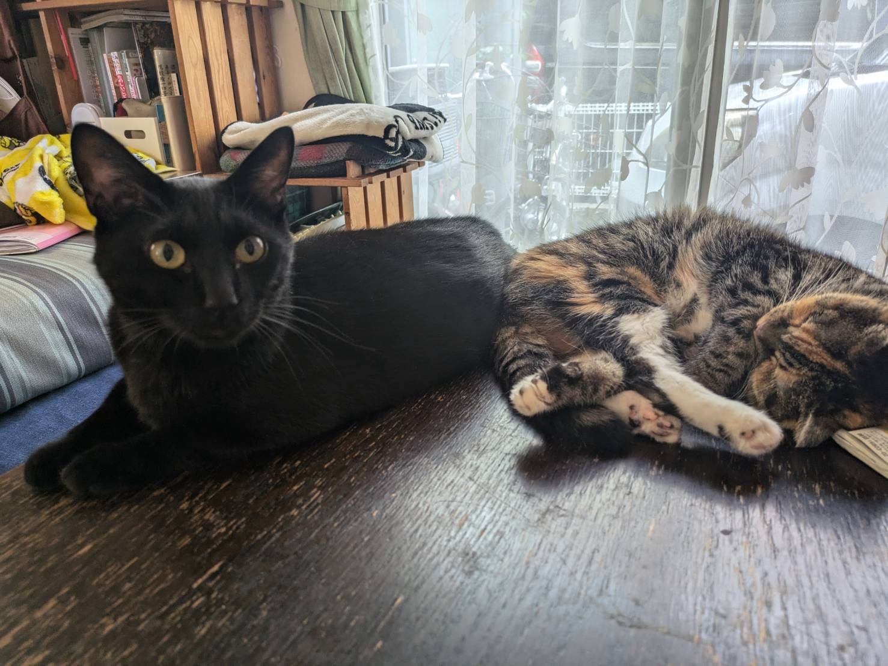
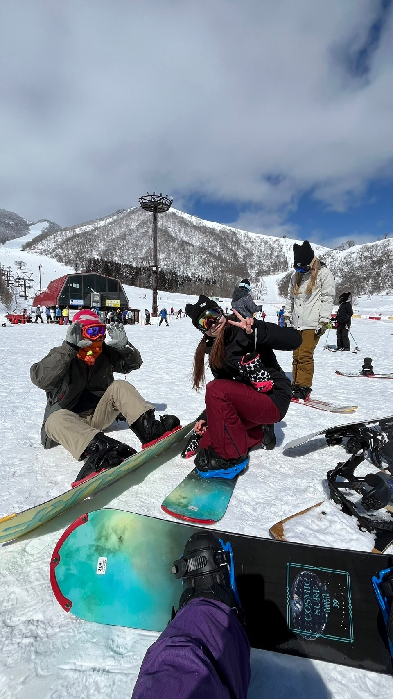

# Morito_R_Silva_H_HW1
This Repository is about our background and history to know each other.

# A little of Rin

My name is **Rin Morito** from Japan.
 I'm 19 years old.
After I graduated in high school, I went to Victoria,BC for eight months to aquire enough English skill to go to college in Canada.

And now I'm enjoy studying Interactive Media Design in Fanshawe College.
I'm a big fan of cats, I have two adorable cats in my home in Japan.

### My hobbies: 

- Cooking
- Ski & Snowbord

- Drive
- Camp

### The ranking of foods that I don't like

1. Coriander
2. Shell fish
3. Perilla

[Rin's Instagram](https://www.instagram.com/r___nn3?igsh=NWo2cmJoazBrYnk1&utm_source=qr)

# A little of Hannah

My name is **Hannah Melo** from Brazil.
 I'm 32 years old, graduated in physiotherapy. Since 2020 I have had the dream of immigrating to Canada and one of the ways I found it was by coming as a student. In addition to this dream, there was also a desire to explore and learn something new and change careers and now i'm trying to dive into the world of graphic design.

### My hobbies

- Watch movies
- Hang out with my friends
- Exercise 
- Run
- Take some drinks

### The ranking of foods that I don't like

1. Coriander
2. Pepper
3. Chouchou

[Hannah's Instagram](https://www.instagram.com/05melohannah/)
